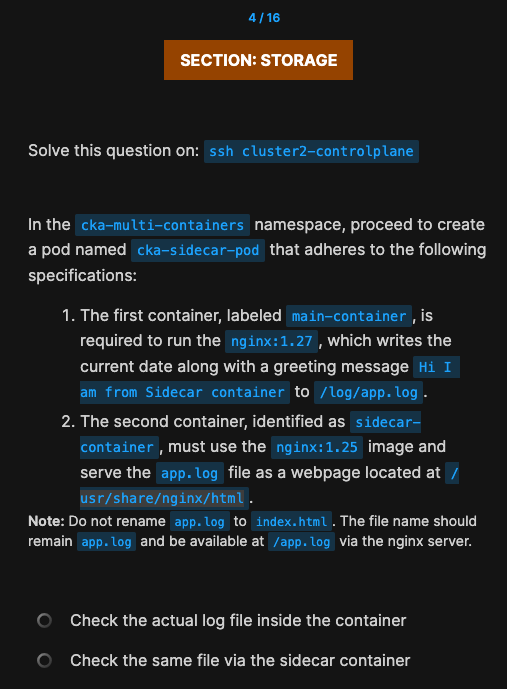
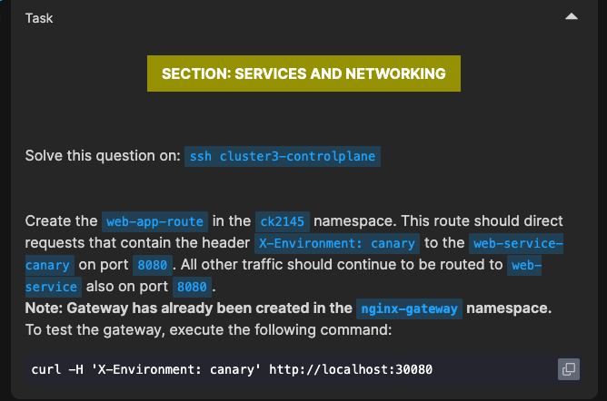
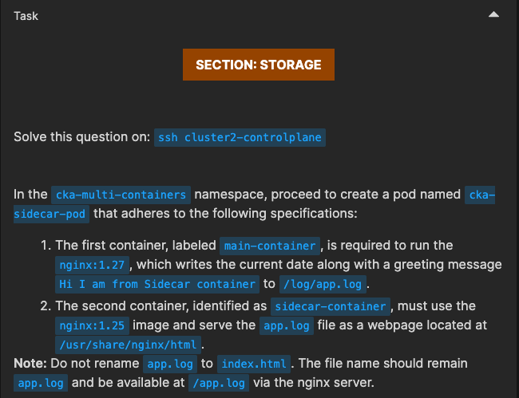
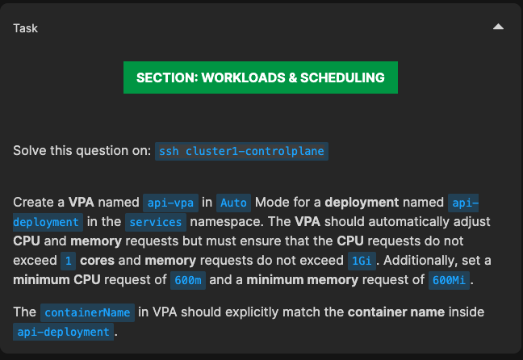
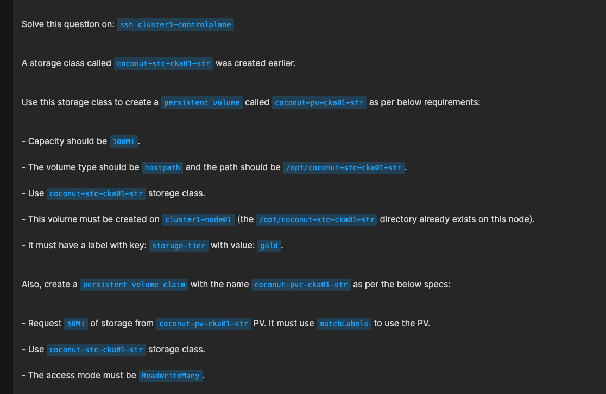
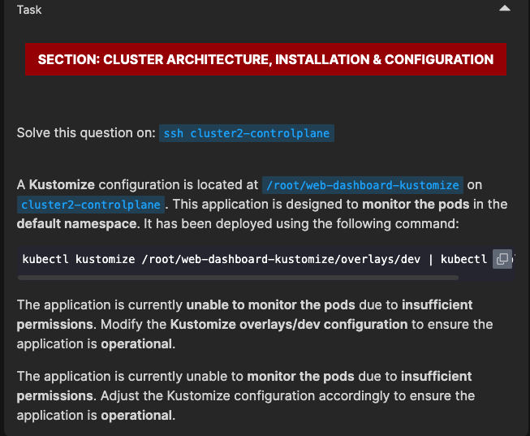

<!-- filepath: /Users/uditmishra/myDev/kubelabs/mocks/udemy-mocks/mock_5.md -->





```
apiVersion: gateway.networking.k8s.io/v1
kind: HTTPRoute
metadata:
  name: web-app-route
  namespace: ck2145
spec:
  parentRefs:
  - name: nginx-gateway 
    namespace: nginx-gateway
  rules:
  - matches:
    - headers:
      - name: X-Environment
        value: canary
    backendRefs:
    - name: web-service-canary
      port: 8080
  - backendRefs:
    - name: web-service
      port: 8080
```

---



```
apiVersion: v1
kind: Pod
metadata:
  name: cka-sidecar-pod
  namespace: cka-multi-containers
spec:
  containers:
    - name: main-container
      image: nginx:1.27
      command: ["/bin/sh"]
      args:
        - -c
        - |
          while true; do
            echo "$(date) Hi I am from Sidecar container" >> /log/app.log;
            sleep 5;
          done
      volumeMounts:
        - name: shared-logs
          mountPath: /log
    - name: sidecar-container
      image: nginx:1.25
      volumeMounts:
        - name: shared-logs
          mountPath: /usr/share/nginx/html
  volumes:
    - name: shared-logs
      emptyDir: {}
```



Be careful with the name of container, double check by describing the deploy. 

apiVersion: autoscaling.k8s.io/v1
kind: VerticalPodAutoscaler
metadata:
  name: api-vpa
  namespace: services
spec:
  targetRef:
    apiVersion: "apps/v1"
    kind: Deployment
    name: api-deployment
  updatePolicy:
    updateMode: "Auto"
  resourcePolicy:
    containerPolicies:
    - containerName: "api-container"
      minAllowed:
        cpu: 600m
        memory: 600Mi
      maxAllowed:
        cpu: 1
        memory: 1Gi
      controlledResources:
      - cpu
      - memory
      controlledValues: RequestsAndLimits

---


read quest carefully.

---
apiVersion: v1
kind: PersistentVolume
metadata:
  name: coconut-pv-cka01-str
  labels: 
    storage-tier: gold
spec:
  capacity:
    storage: 100Mi
  accessModes:
    - ReadWriteMany
  hostPath:
    path: /opt/coconut-stc-cka01-str
  storageClassName: coconut-stc-cka01-str
  nodeAffinity:
    required:
      nodeSelectorTerms:
        - matchExpressions:
            - key: kubernetes.io/hostname
              operator: In
              values:
                - cluster1-node01
---
apiVersion: v1
kind: PersistentVolumeClaim
metadata:
  name: coconut-pvc-cka01-str
spec:
  accessModes:
    - ReadWriteMany
  resources:
    requests:
      storage: 50Mi
  storageClassName: coconut-stc-cka01-str
  selector: 
    matchLabels:
      storage-tier: gold

---


